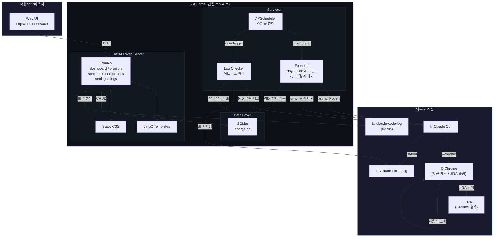
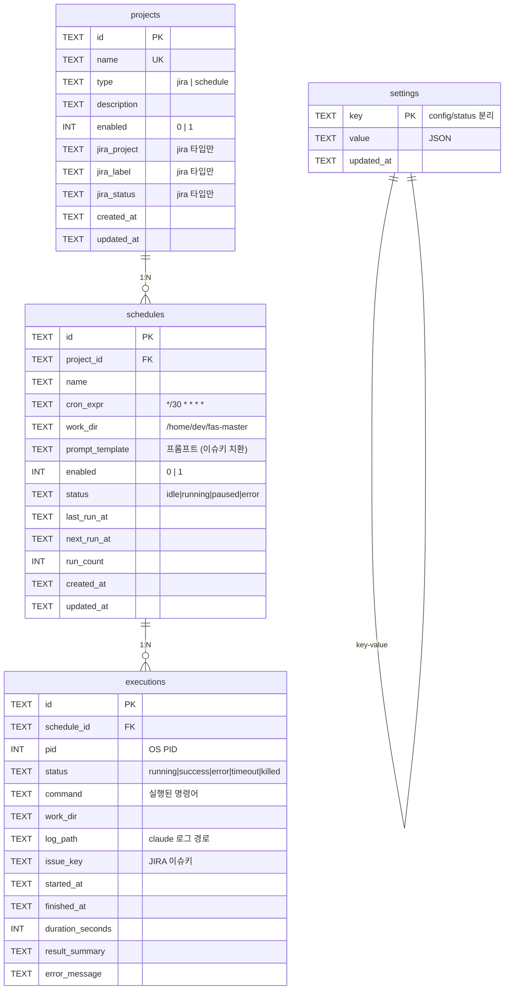
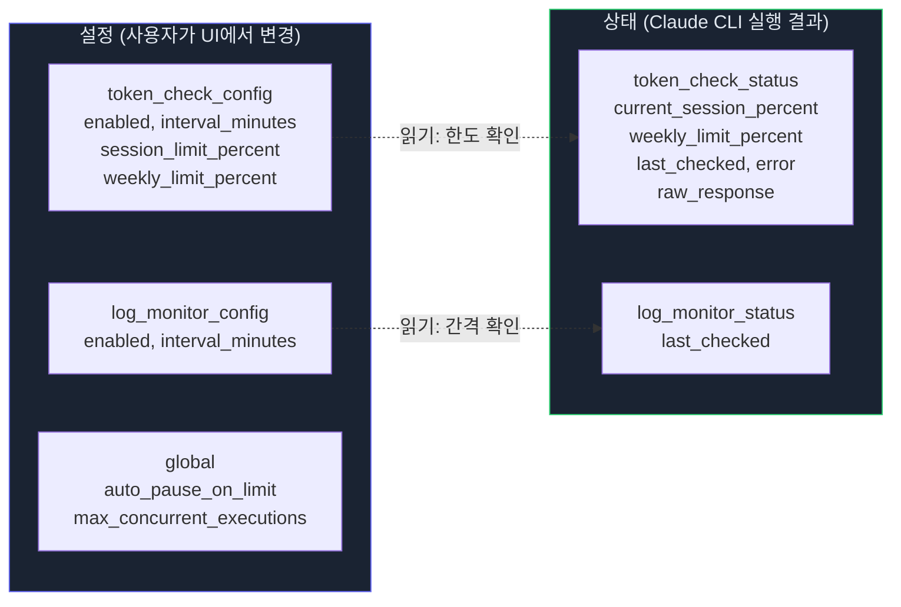
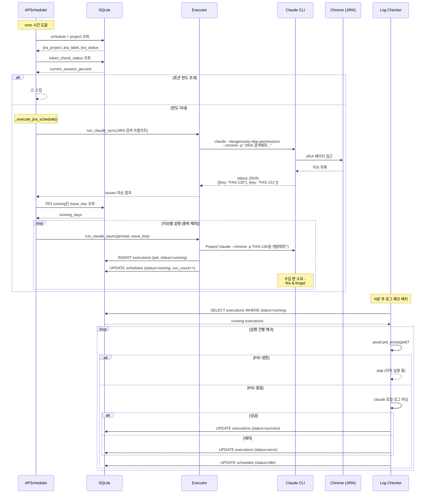
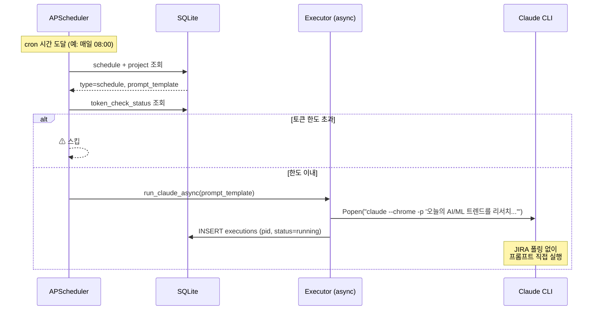
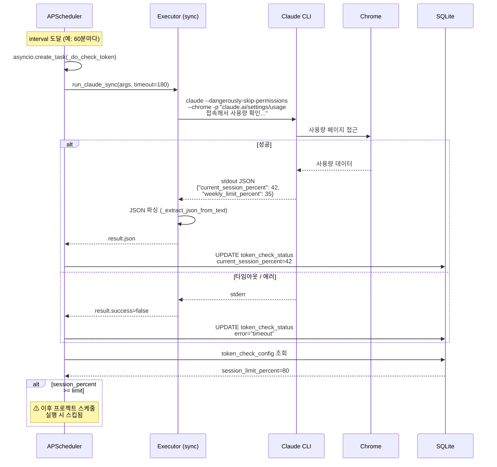
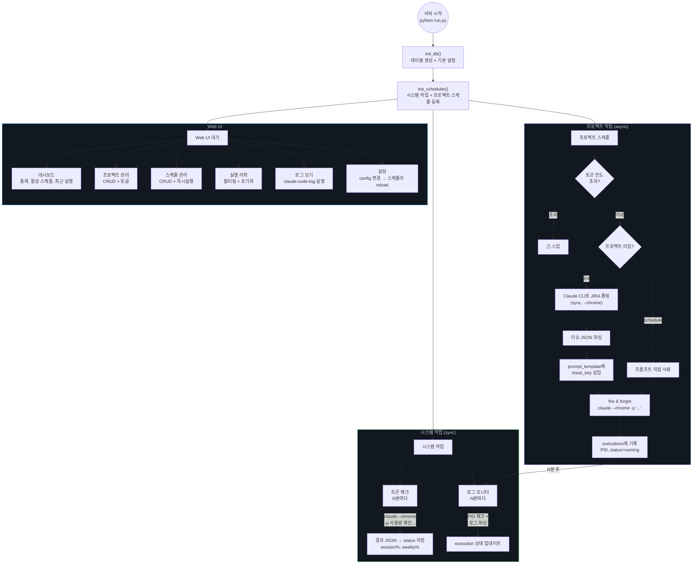

# 1. 시스템 아키텍처

```mermaid
graph TB
    subgraph External["외부 시스템"]
        JIRA["🔷 JIRA<br/>(Chrome 경유)"]
        CLAUDE_CLI["🤖 Claude CLI"]
        CLAUDE_LOG["📄 Claude Local Log"]
        CHROME["🌐 Chrome<br/>(토큰 체크 / JIRA 폴링)"]
        CLAUDE_CODE_LOG["📊 claude-code-log<br/>(uv run)"]
    end

    subgraph AIForge["⚡ AIForge (단일 프로세스)"]
        subgraph Web["FastAPI Web Server"]
            ROUTES["Routes<br/>dashboard / projects<br/>schedules / executions<br/>settings / logs"]
            JINJA["Jinja2 Templates"]
            STATIC["Static CSS"]
        end

        subgraph Services["Services"]
            SCHEDULER["APScheduler<br/>스케줄 관리"]
            EXECUTOR["Executor<br/>async: fire & forget<br/>sync: 결과 대기"]
            LOG_CHECKER["Log Checker<br/>PID/로그 파싱"]
        end

        subgraph Data["Data Layer"]
            DB["SQLite<br/>aiforge.db"]
        end
    end

    subgraph Browser["사용자 브라우저"]
        UI["Web UI<br/>http://localhost:8000"]
    end

    UI -->|HTTP| ROUTES
    ROUTES --> JINJA
    ROUTES --> STATIC
    ROUTES -->|CRUD| DB
    ROUTES -->|로그 생성| CLAUDE_CODE_LOG

    SCHEDULER -->|cron trigger| EXECUTOR
    SCHEDULER -->|cron trigger| LOG_CHECKER

    EXECUTOR -->|"async: Popen"| CLAUDE_CLI
    EXECUTOR -->|"sync: 결과 대기"| CLAUDE_CLI
    EXECUTOR -->|PID, 상태 기록| DB

    CLAUDE_CLI -->|"--chrome"| CHROME
    CHROME -->|JIRA 검색| JIRA
    CHROME -->|사용량 조회| CHROME

    CLAUDE_CLI -->|stdout| CLAUDE_LOG

    LOG_CHECKER -->|PID 생존 체크| CLAUDE_CLI
    LOG_CHECKER -->|로그 파싱| CLAUDE_LOG
    LOG_CHECKER -->|상태 업데이트| DB

    style AIForge fill:#0d1117,stroke:#6366f1,color:#e2e8f0
    style External fill:#1a1a2e,stroke:#3498db,color:#e2e8f0
    style Browser fill:#1a1a2e,stroke:#2ecc71,color:#e2e8f0
    style Web fill:#111820,stroke:#1e2a3a,color:#c5cdd9
    style Services fill:#111820,stroke:#1e2a3a,color:#c5cdd9
    style Data fill:#111820,stroke:#1e2a3a,color:#c5cdd9
```

---

# 2. DB 스키마 ERD

```mermaid
erDiagram
    projects ||--o{ schedules : "1:N"
    schedules ||--o{ executions : "1:N"
    settings ||--|| settings : "key-value"

    projects {
        TEXT id PK
        TEXT name UK
        TEXT type "jira | schedule"
        TEXT description
        INT enabled "0 | 1"
        TEXT jira_project "jira 타입만"
        TEXT jira_label "jira 타입만"
        TEXT jira_status "jira 타입만"
        TEXT created_at
        TEXT updated_at
    }

    schedules {
        TEXT id PK
        TEXT project_id FK
        TEXT name
        TEXT cron_expr "*/30 * * * *"
        TEXT work_dir "/home/dev/fas-master"
        TEXT prompt_template "프롬프트 (이슈키 치환)"
        INT enabled "0 | 1"
        TEXT status "idle|running|paused|error"
        TEXT last_run_at
        TEXT next_run_at
        INT run_count
        TEXT created_at
        TEXT updated_at
    }

    executions {
        TEXT id PK
        TEXT schedule_id FK
        INT pid "OS PID"
        TEXT status "running|success|error|timeout|killed"
        TEXT command "실행된 명령어"
        TEXT work_dir
        TEXT log_path "claude 로그 경로"
        TEXT issue_key "JIRA 이슈키"
        TEXT started_at
        TEXT finished_at
        INT duration_seconds
        TEXT result_summary
        TEXT error_message
    }

    settings {
        TEXT key PK "config/status 분리"
        TEXT value "JSON"
        TEXT updated_at
    }
```

---

# 3. Settings 키 구조

```mermaid
graph LR
    subgraph Config["설정 (사용자가 UI에서 변경)"]
        TC["token_check_config<br/>enabled, interval_minutes<br/>session_limit_percent<br/>weekly_limit_percent"]
        LC["log_monitor_config<br/>enabled, interval_minutes"]
        GC["global<br/>auto_pause_on_limit<br/>max_concurrent_executions"]
    end

    subgraph Status["상태 (Claude CLI 실행 결과)"]
        TS["token_check_status<br/>current_session_percent<br/>weekly_limit_percent<br/>last_checked, error<br/>raw_response"]
        LS["log_monitor_status<br/>last_checked"]
    end

    TC -.->|"읽기: 한도 확인"| TS
    LC -.->|"읽기: 간격 확인"| LS

    style Config fill:#1a2332,stroke:#6366f1,color:#e2e8f0
    style Status fill:#1a2332,stroke:#2ecc71,color:#e2e8f0
```

---

# 4. JIRA 타입 실행 순서도

```mermaid
sequenceDiagram
    participant SCH as APScheduler
    participant DB as SQLite
    participant EX as Executor
    participant CLI as Claude CLI
    participant CHROME as Chrome (JIRA)
    participant LC as Log Checker

    Note over SCH: cron 시간 도달
    SCH->>DB: schedule + project 조회
    DB-->>SCH: jira_project, jira_label, jira_status

    SCH->>DB: token_check_status 조회
    DB-->>SCH: current_session_percent

    alt 토큰 한도 초과
        SCH-->>SCH: ⚠ 스킵
    else 한도 이내
        Note over SCH: _execute_jira_schedule()
        SCH->>EX: run_claude_sync(JIRA 검색 프롬프트)
        EX->>CLI: claude --dangerously-skip-permissions<br/>--chrome -p "JIRA 검색해줘..."
        CLI->>CHROME: JIRA 페이지 접근
        CHROME-->>CLI: 이슈 목록
        CLI-->>EX: stdout JSON<br/>[{key: "FAS-130"}, {key: "FAS-131"}]
        EX-->>SCH: issues 파싱 결과

        SCH->>DB: 이미 running인 issue_key 조회
        DB-->>SCH: running_keys

        loop 이슈별 실행 (중복 제외)
            SCH->>EX: run_claude_async(prompt, issue_key)
            EX->>CLI: Popen("claude --chrome -p 'FAS-130을 개발해줘'")
            EX->>DB: INSERT executions (pid, status=running)
            EX->>DB: UPDATE schedules (status=running, run_count++)
            Note over CLI: 수십 분 소요...<br/>fire & forget
        end
    end

    Note over LC: N분 후 로그 체크 배치
    LC->>DB: SELECT executions WHERE status=running
    DB-->>LC: running executions

    loop 실행 건별 체크
        LC->>LC: psutil.pid_exists(pid)?

        alt PID 생존
            LC-->>LC: skip (아직 실행 중)
        else PID 종료
            LC->>LC: claude 로컬 로그 파싱
            alt 성공
                LC->>DB: UPDATE executions (status=success)
            else 에러
                LC->>DB: UPDATE executions (status=error)
            end
            LC->>DB: UPDATE schedules (status=idle)
        end
    end
```

---

# 5. Schedule 타입 실행 순서도

```mermaid
sequenceDiagram
    participant SCH as APScheduler
    participant DB as SQLite
    participant EX as Executor (async)
    participant CLI as Claude CLI

    Note over SCH: cron 시간 도달 (예: 매일 08:00)
    SCH->>DB: schedule + project 조회
    DB-->>SCH: type=schedule, prompt_template

    SCH->>DB: token_check_status 조회
    alt 토큰 한도 초과
        SCH-->>SCH: ⚠ 스킵
    else 한도 이내
        SCH->>EX: run_claude_async(prompt_template)
        EX->>CLI: Popen("claude --chrome -p '오늘의 AI/ML 트렌드를 리서치...'")
        EX->>DB: INSERT executions (pid, status=running)
        Note over CLI: JIRA 폴링 없이<br/>프롬프트 직접 실행
    end
```

---

# 6. 시스템 작업 순서도 (토큰 체크)

```mermaid
sequenceDiagram
    participant SCH as APScheduler
    participant EX as Executor (sync)
    participant CLI as Claude CLI
    participant CHROME as Chrome
    participant DB as SQLite

    Note over SCH: interval 도달 (예: 60분마다)
    SCH->>SCH: asyncio.create_task(_do_check_token)
    SCH->>EX: run_claude_sync(args, timeout=180)
    EX->>CLI: claude --dangerously-skip-permissions<br/>--chrome -p "claude.ai/settings/usage<br/>접속해서 사용량 확인..."
    CLI->>CHROME: 사용량 페이지 접근

    alt 성공
        CHROME-->>CLI: 사용량 데이터
        CLI-->>EX: stdout JSON<br/>{"current_session_percent": 42,<br/>"weekly_limit_percent": 35}
        EX->>EX: JSON 파싱 (_extract_json_from_text)
        EX-->>SCH: result.json
        SCH->>DB: UPDATE token_check_status<br/>current_session_percent=42
    else 타임아웃 / 에러
        CLI-->>EX: stderr
        EX-->>SCH: result.success=false
        SCH->>DB: UPDATE token_check_status<br/>error="timeout"
    end

    SCH->>DB: token_check_config 조회
    DB-->>SCH: session_limit_percent=80

    alt session_percent >= limit
        Note over SCH: ⚠ 이후 프로젝트 스케줄<br/>실행 시 스킵됨
    end
```

---

# 7. 파일 구조

```mermaid
graph TD
    ROOT["aiforge/"]
    ROOT --> RUN["run.py<br/>uvicorn 진입점"]
    ROOT --> SCHEMA["schema.sql<br/>DDL"]
    ROOT --> REQ["requirements.txt"]
    ROOT --> APP["app/"]

    APP --> MAIN["main.py<br/>FastAPI + lifespan"]
    APP --> DATABASE["database.py<br/>SQLite 연결/쿼리"]
    APP --> MODELS["models.py<br/>Pydantic"]

    APP --> ROUTES["routes/"]
    ROUTES --> R1["dashboard.py"]
    ROUTES --> R2["projects.py"]
    ROUTES --> R3["schedules.py"]
    ROUTES --> R4["executions.py"]
    ROUTES --> R5["settings.py"]
    ROUTES --> R6["logs.py"]

    APP --> SERVICES["services/"]
    SERVICES --> S1["scheduler.py<br/>APScheduler 관리"]
    SERVICES --> S2["executor.py<br/>async + sync 모드"]
    SERVICES --> S3["jira_client.py<br/>JIRA REST API (예비)"]
    SERVICES --> S4["log_checker.py<br/>PID/로그 파싱"]

    APP --> TEMPLATES["templates/"]
    TEMPLATES --> T1["base.html"]
    TEMPLATES --> T2["dashboard.html"]
    TEMPLATES --> T3["projects.html<br/>project_form.html"]
    TEMPLATES --> T4["schedules.html<br/>schedule_form.html"]
    TEMPLATES --> T5["executions.html"]
    TEMPLATES --> T6["settings.html"]
    TEMPLATES --> T7["logs.html"]

    APP --> STATICS["static/"]
    STATICS --> CSS["style.css"]

    style ROOT fill:#0d1117,stroke:#6366f1,color:#e2e8f0
    style APP fill:#111820,stroke:#1e2a3a,color:#c5cdd9
    style ROUTES fill:#1a2332,stroke:#3498db,color:#c5cdd9
    style SERVICES fill:#1a2332,stroke:#2ecc71,color:#c5cdd9
    style TEMPLATES fill:#1a2332,stroke:#9b59b6,color:#c5cdd9
```

---

# 8. 전체 데이터 흐름 요약

```mermaid
flowchart TD
    START(("서버 시작<br/>python run.py"))
    START --> INIT_DB["init_db()<br/>테이블 생성 + 기본 설정"]
    INIT_DB --> INIT_SCH["init_scheduler()<br/>시스템 작업 + 프로젝트 스케줄 등록"]

    INIT_SCH --> SYS_JOBS["시스템 작업"]
    INIT_SCH --> PRJ_JOBS["프로젝트 스케줄"]
    INIT_SCH --> WEB["Web UI 대기"]

    subgraph System["시스템 작업 (sync)"]
        SYS_JOBS --> TOKEN["토큰 체크<br/>N분마다"]
        SYS_JOBS --> LOG["로그 모니터<br/>N분마다"]

        TOKEN -->|"claude --chrome<br/>-p 사용량 확인..."| TOKEN_RESULT["결과 JSON → status 저장<br/>session%, weekly%"]
        LOG -->|"PID 체크 +<br/>로그 파싱"| LOG_RESULT["execution 상태 업데이트"]
    end

    subgraph Project["프로젝트 작업 (async)"]
        PRJ_JOBS --> CHECK_TOKEN{"토큰 한도<br/>초과?"}
        CHECK_TOKEN -->|초과| SKIP["⚠ 스킵"]
        CHECK_TOKEN -->|이내| TYPE{프로젝트 타입?}
        TYPE -->|jira| POLL["Claude CLI로 JIRA 폴링<br/>(sync, --chrome)"]
        TYPE -->|schedule| DIRECT["프롬프트 직접 사용"]

        POLL --> ISSUES["이슈 JSON 파싱"]
        ISSUES --> PROMPT["prompt_template에<br/>issue_key 삽입"]
        PROMPT --> FIRE["fire & forget<br/>claude --chrome -p '...'"]
        DIRECT --> FIRE

        FIRE --> EXEC_DB["executions에 기록<br/>PID, status=running"]
        EXEC_DB -->|"N분 후"| LOG
    end

    subgraph UI["Web UI"]
        WEB --> DASHBOARD["대시보드<br/>통계, 활성 스케줄, 최근 실행"]
        WEB --> PRJ_PAGE["프로젝트 관리<br/>CRUD + 토글"]
        WEB --> SCH_PAGE["스케줄 관리<br/>CRUD + 즉시실행"]
        WEB --> EXEC_PAGE["실행 이력<br/>필터링 + 초기화"]
        WEB --> LOG_PAGE["로그 보기<br/>claude-code-log 실행"]
        WEB --> SET_PAGE["설정<br/>config 변경 → 스케줄러 reload"]
    end

    style System fill:#111820,stroke:#2ecc71,color:#c5cdd9
    style Project fill:#111820,stroke:#6366f1,color:#c5cdd9
    style UI fill:#111820,stroke:#3498db,color:#c5cdd9
```
